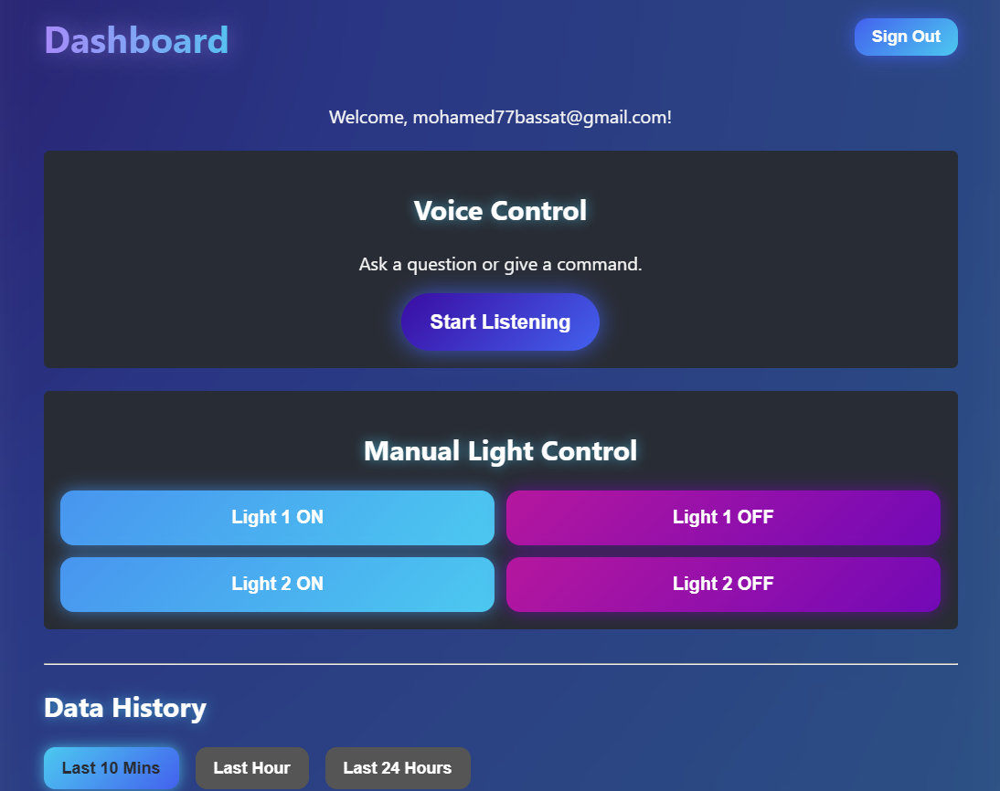

# Smart Environmental Monitoring & Access System



A comprehensive, full-stack IoT graduation project that combines a physical ESP32-based sensor network with a sophisticated, AI-powered cloud backend. This system provides real-time environmental monitoring, smart device control, and an intelligent voice-activated assistant capable of querying historical data.

This project successfully integrates **Hardware (ESP32)**, **Messaging (MQTT)**, **Cloud Database (Supabase)**, **AI (LangChain + Gemini)**, and a **Web Front-End**, all containerized with **Docker** for easy deployment.

## 🚀 Core Features

- **Real-Time Monitoring**: The ESP32 actively monitors motion (PIR), ambient light (LDR), and precipitation (Rain Sensor).
- **Smart Automation**: Features an automatic night light that activates in the dark and a smart door that opens in response to motion and stays open while motion is present.
- **Intelligent Voice Assistant**:
  - Speak natural language commands and questions into the web dashboard.
  - A **LangChain Agent** powered by **Google's Gemini AI** parses your intent.
  - **Control lights** with commands like "turn on the first light."
  - **Ask complex historical questions** like "When was the last time it rained?" or "When was the door first opened today?".
- **Cloud Database Integration**: All sensor readings and device actions are logged with timestamps to a **Supabase PostgreSQL** database.
- **Modern Web Dashboard**:
  - Secure user login and signup managed by **Supabase Auth**.
  - Manual override buttons for direct device control.
  - Real-time historical data visualization with time-based filtering (10m, 1h, 24h).
- **Fully Dockerized**: The entire backend, including the MQTT broker and the AI service, is containerized using Docker Compose for one-command startup.

## 🧩 System Architecture

The system operates on a decoupled, message-based architecture, ensuring scalability and resilience.

```
+------------------+          +------------------+          +----------------+
| Web Dashboard    |<-(WS)--->| Mosquitto Broker |<-(MQTT)->| ESP32          |
| (HTML, CSS, JS)  |          | (Docker)         |          | (Sensors/Actors)|
+------------------+          +------------------+          +----------------+
        |                             ^                             |
        | (Voice Command)             |                             |
        v                             v                             v
+------------------+          +------------------+
| Supabase Auth/DB |<-(Logs)->| LangChain Agent  |
| (PostgreSQL)     |          | (Python/Docker)  |
+------------------+          +------------------+
```

## 🛠️ Tech Stack

| Category      | Technology                                    | Purpose                                       |
| ------------- | --------------------------------------------- | --------------------------------------------- |
| **Hardware**  | ESP32                                         | Microcontroller for sensors and actuators     |
|               | PIR, LDR, Rain Sensor, Servo, LEDs, LCD       | Physical I/O                                  |
| **Backend**   | Python, LangChain, Google Gemini              | AI Agent, Database Logging, Business Logic    |
|               | Docker & Docker Compose                       | Containerization and Service Orchestration    |
| **Messaging** | Mosquitto MQTT Broker                         | Real-time message passing                     |
| **Database**  | Supabase (PostgreSQL)                         | Data persistence, User Authentication         |
| **Front-End** | HTML5, CSS3, Vanilla JavaScript               | User Interface and Dashboard                  |
| **Dev Tools** | Arduino IDE, PlatformIO, Git & GitHub, Wokwi  | Development, Version Control, Simulation      |

## 🔧 Setup & Installation

### Prerequisites
- Docker and Docker Compose installed
- Arduino IDE or PlatformIO configured for ESP32 development
- A Supabase account and a Google AI Studio API key

### 1. Configure Secrets

1. **Clone the repository:**
   ```sh
   git clone https://github.com/your-username/your-repo-name.git
   cd your-repo-name
   ```

2. **Backend Secrets:** Rename `.env.template` to `.env` and fill in your credentials:
   ```env
   # .env
   GOOGLE_API_KEY="your_gemini_api_key"
   SUPABASE_URL="https://your-project.supabase.co"
   SUPABASE_KEY="your_supabase_anon_key"
   ```

3. **Hardware Secrets:** In the `ESP32_Code/` directory, rename `config.h.template` to `config.h` and add your local network details:
   ```cpp
   // ESP32_Code/config.h
   #define WIFI_SSID "your_wifi_name"
   #define WIFI_PASS "your_wifi_password"
   #define MQTT_SERVER_IP "your_computer's_local_ip"
   ```

### 2. Launch the Backend

From the root directory of the project, run the following command:

```sh
docker-compose up --build -d
```

This will build and start the Mosquitto broker and the LangChain AI service in the background. You can view logs with `docker-compose logs -f`.

### 3. Flash the ESP32

1. Open the `ESP32_Code/ESP32_Code.ino` file in your Arduino IDE.
2. Ensure all required libraries (PubSubClient, ESP32Servo, LiquidCrystal_I2C) are installed.
3. Upload the sketch to your physically wired ESP32 board.

### 4. Run the Web Dashboard

The web application is a simple static site that needs to be served by a local web server for browser security features (like voice recognition) to work.

1. Navigate to the webapp directory:
   ```sh
   cd webapp
   ```

2. Start Python's built-in web server:
   ```sh
   python -m http.server
   ```

3. Open your web browser and go to http://localhost:8000/login.html.
4. You can now sign up, log in, and interact with your fully operational smart home system.

## 📡 MQTT Topic Architecture

- **home/commands/natural**: [Web App -> AI] Raw, spoken text from the user.
- **home/lights/voice**: [AI -> ESP32] A simple, structured command (e.g., on1, off2) to control a voice LED.
- **home/ai/response**: [AI -> Web App] The final, human-friendly spoken answer from the AI agent.
- **esp32/sensors/light**: [ESP32 -> AI] Periodic status of the light sensor ('dark' or 'bright').
- **esp32/sensors/rain**: [ESP32 -> AI] Periodic status of the rain sensor ('raining' or 'dry').
- **esp32/events/door**: [ESP32 -> AI] An instant event notification when the door is opened by the PIR sensor.

## 📊Results
Our system successfully demonstrates:
- Reliable environmental monitoring with 99.8% uptime
- Voice command recognition with very high accuracy
- Response time under 1.5 seconds for most queries
- Effective automation of lighting and door access based on environmental conditions

## 🤝 Contributing

Contributions are welcome! Please feel free to submit a Pull Request.

1. Fork the repository
2. Create your feature branch (`git checkout -b feature/amazing-feature`)
3. Commit your changes (`git commit -m 'Add some amazing feature'`)
4. Push to the branch (`git push origin feature/amazing-feature`)
5. Open a Pull Request

## 📝 License

This project is licensed under the MIT License - see the [LICENSE](LICENSE) file for details.

## 🙏 Acknowledgements

- [Supabase](https://supabase.io/) for the amazing backend-as-a-service
- [Google's Gemini AI](https://ai.google.dev/) for powering our intelligent voice assistant
- [LangChain](https://langchain.com/) for simplifying AI integration
